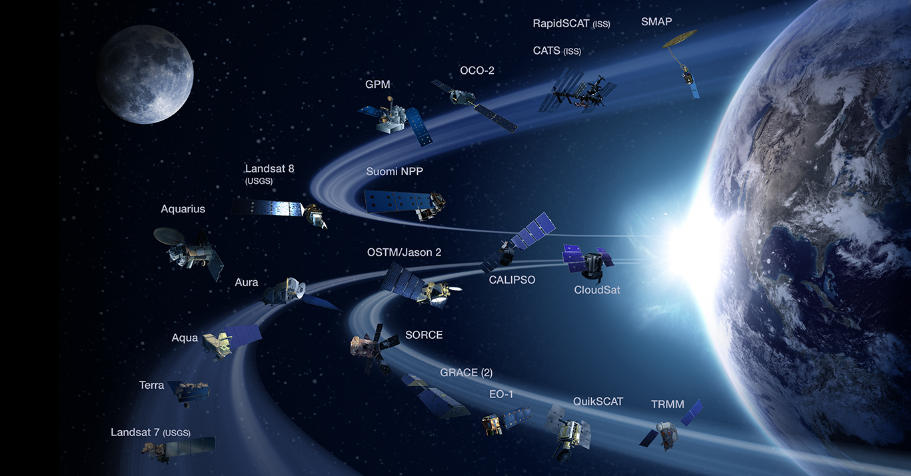

```{r setup, include=FALSE}
knitr::opts_chunk$set(echo = FALSE)
```

## Agenda

```{r, echo=FALSE, fig.align='center', out.width="1200px"}
   knitr::include_graphics('./Agenda1.png')
```

## Earth Engine - An Introduction

- [Intro Video](https://earthengine.google.com)


## Earth Engine Motivation

- Researchers can spend disproportionate amount of time doing IT work

```{r, echo=FALSE, fig.align='center', out.width="800px"}
   knitr::include_graphics('./Image1.png')
```

## Earth Engine Motivation

- 'Often it turns out to be more efficient to move the questions than move the data' - [Jim Gray, The Fourth Paradigm](https://www.microsoft.com/en-us/research/wp-content/uploads/2009/10/Fourth_Paradigm.pdf)

```{r, echo=FALSE, fig.align='center', out.width="800px"}
   knitr::include_graphics('./Image2.png')
```

## Earth Engine Motivation

- Petabytes and petabytes of Earth observation data being collected
- Global-scale problems requiring analysis of increasingly larger and more complex geospatial data

```{r, echo=FALSE, fig.align='center', out.width="800px", fig.cap='Image source: NASA public domain'}
   
```

## Agenda

```{r, echo=FALSE, fig.align='center', out.width="1200px"}
   knitr::include_graphics('./Agenda2.png')
```

## Earth Engine Fundamentals 

"Earth Engine is not like any GIS you have ever used before! ... it is incredibly powerful. It is also strange and wondrous."  - [EE Developers Overview page](https://developers.google.com/earth-engine/concepts_overview)

- EE is a cloud-based platform for planetary-scale environmnetal data analysis, composed of:
   * Datasets, Google Computational Infrastructure, APIs, and a Code Editor (see [developers.google.com/earth-engine](developers.google.com/earth-engine))
- Images in Earth Engine stored at native resolution in native projection
- EE projects to Mercator when you dispaly images in code editor, and uses nearest neighbor sampling by default

## Earth Engine Fundamentals 
You'll need to sign up for an [Earth Engine account](http://signup.earthengine.google.com) to use the tools

- [The Explorer](http://explorer.earthengine.google.com): A Simple interface for visualization and basic analyses

- [EE Dataset Catalog](https://developers.google.com/earth-engine/datasets): A catalog of all available public datasets with great details on each dataset

- [The Code Editor](code.earthengine.google.com): The primary interface for EE - we'll go into details

## Earth Engine Fundamentals
- Much of these first several slides borrowed from [here](https://docs.google.com/presentation/d/10DTcBGPl0JeTEOJlSRNdj9dtGLwqq7HPLzegENygI-U/edit?usp=sharing)
- Almost all the breakout sessions at Geo4Good / EE Summit posted [here](https://sites.google.com/earthoutreach.org/geoforgood19/agenda/breakout-sessions) 

## Earth Engine Fundamentals

[The Code Editor](code.earthengine.google.com)

- A web-based environment for:

    * Running analyses
    
    * Investigating datasets
    
    * Managing scripts and data
    
    * Building interactive apps

## Earth Engine Fundamentals

```{r, echo=FALSE, fig.align='center', out.width="1200px",fig.cap='Image source: https://developers.google.com/earth-engine/playground'}
   knitr::include_graphics('./CodeEditor.png')
```

## Earth Engine Fundamentals
Earth Engine Objects:

- Images 
- Features
- Collections

## Earth Engine Fundamentals

<div class='left' style='float:left;width:48%'>

- Images have:

   * Bands: grid of pixels that have:
      + Name
      + CRS / Projection
      + Scale
   * Properites, at a minimum:
      + Date
      + Bounding box
      + Unique ID
      
</div>

<div class='right' style='float:right;width:48%'>


```{r, echo=FALSE, fig.align='center', out.width="600px",fig.cap='6-Band Image'}
   knitr::include_graphics('./Bands.png')
```
</div>


## Earth Engine Fundamentals

<div class='left' style='float:left;width:48%'>

- Features have:

   * Geometry (Point, Line, Polygon)
   * Properties (Same as images)
   * Features have geomtry property and a 'properties' property
      + 'properties' property just a dictionary for each feature
</div>

<div class='right' style='float:right;width:48%'>


```{r, echo=FALSE, fig.align='center', out.width="700px",fig.cap='US Omernik Level 3 Ecoregions'}
   knitr::include_graphics('./US_L3_Ecos.png')
```
</div>

## Earth Engine Fundamentals

Collections

- Collections are typically what you encounter in the wild in EE
- They are unmodifiable, homogenous lists
- Both features and  images come as FeatureCollections or ImageCollections
- Take a minute to scroll through the [EE Data Catalog](https://developers.google.com/earth-engine/datasets)
   + You'll notice most datasets you check are image or feature collections

## Earth Engine Fundamentals
Filtering, Mapping and Reducing
-  

## Earth Engine Fundamentals
Lazy Eval and Batch Processing

- Results only derived when and where needed
     * i.e. in map window for display; as result of print statement
     
## Map and Reduce Operations

## Python API

## Personal and public assets
- [Requests](https://developers.google.com/earth-engine/help#dataset-requests)

