```{r setup, include=FALSE}
knitr::opts_chunk$set(echo = FALSE)
```

##

```{r, echo=FALSE, fig.align='center', out.width="1200px"}
   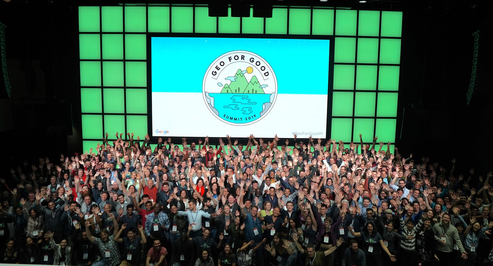
```

## Agenda

```{r, echo=FALSE, fig.align='center', out.width="1200px"}
   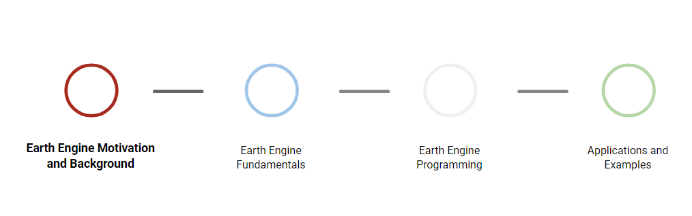
```

## Earth Engine Motivation

- Researchers can spend disproportionate amount of time doing IT work

```{r, echo=FALSE, fig.align='center', out.width="800px"}
   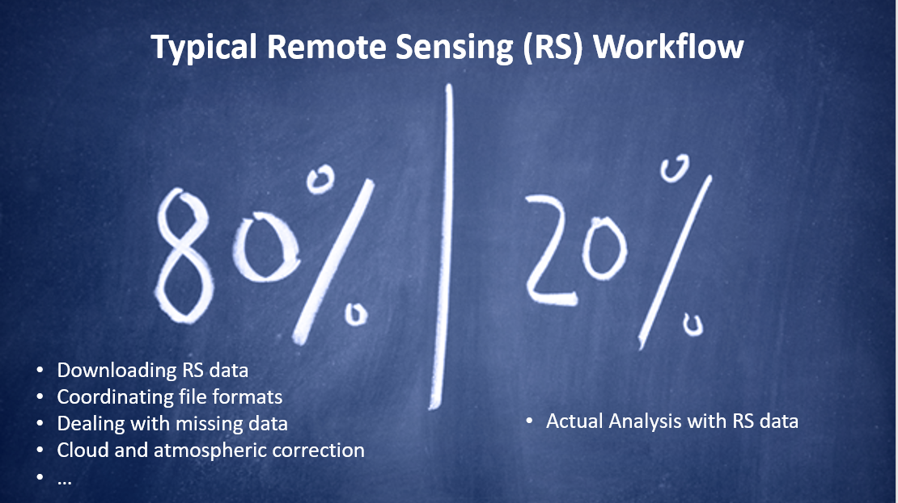
```

## Earth Engine Motivation

- 'Often it turns out to be more efficient to move the questions than move the data' - [Jim Gray, The Fourth Paradigm](https://www.microsoft.com/en-us/research/wp-content/uploads/2009/10/Fourth_Paradigm.pdf)

```{r, echo=FALSE, fig.align='center', out.width="800px"}
   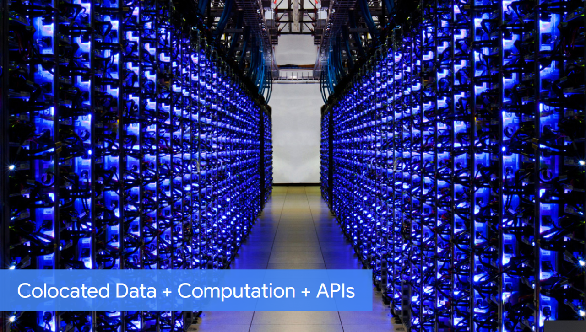
```

## What Is Earth Engine?

Groelick et al. (2017) in ['Google Earth Engine: Planetory-scale geospatial analysis for everyone' in *Remote Sensing of the Environment*](https://www.sciencedirect.com/science/article/pii/S0034425717302900):

> "Google Earth Engine is a cloud-based platform for planetary-scale geospatial analysis that brings Google’s massive computational capabilities to bear on a variety of high-impact societal issues including deforestation, drought, disaster, disease, food security, water management, climate monitoring and environmental protection."

## Why Use Earth Engine?

- Petabytes and petabytes of Earth observation data being collected
- Planetary Science: global-scale problems requiring analysis of increasingly larger and more complex geospatial data
 - A number of ground-breaking studies and papers have come out in recent years leveraging the power of large-scale computing in GEE on environmental and social problems

```{r, echo=FALSE, fig.align='center', out.width="1600px"}
   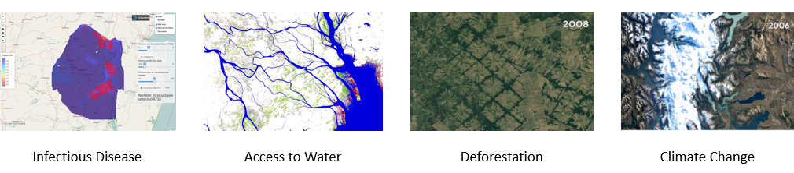
```

## Why Use Earth Engine?

Motivating Case Studies:

- [Global Forest Watch](http://www.globalforestwatch.org/)
Online platform to interactively show forest gain / loss at global scale
   + [Hansen et al (2013) Paper in Science](http://science.sciencemag.org/content/342/6160/850)
   + [GEE tutorial using the Hansen data](https://developers.google.com/earth-engine/tutorial_forest_01)
   
```{r, echo=FALSE, fig.align='center', out.width="800px", fig.cap='Deforestation in Paraguay 2000-2012'}
   knitr::include_graphics('https://www.moore.org/images/default-source/grants/other-grant-images/.gif?sfvrsn=32ed920d_2')
```

## Why Use Earth Engine?

Motivating Case Studies:

- [Global Surface Water Paper in Nature (Pekel at al 2017)](https://www.nature.com/articles/nature20584)
Global mapping of water loss and gain since 1984 for larger waterbodies
   + [Global Surface Water Data Explorer](https://global-surface-water.appspot.com/)
   + [GEE tutorial using the Pekel data](https://geohackweek.github.io/GoogleEarthEngine/01-introduction/)
   + [Data Users Guide](https://storage.googleapis.com/global-surface-water/downloads_ancillary/DataUsersGuidev2.pdf)

## Why Use Earth Engine?

Motivating Case Studies:

- [Global Travel Times](https://map.ox.ac.uk/research-project/accessibility_to_cities/)
A map of travel times from any point in world to the nearest urban center produced by Oxford Malariea Atlas Project, EU Joint Research Center, and University of Twente. Shows areas with limited access to services for public health / policy decisions
   + [Original paper in Nature (Weiss et al 2018)](https://www.nature.com/articles/nature25181)
   + [Example EE script for visualizing the data](https://code.earthengine.google.com/d52c656d3098b2723b275cc0d113d05e)
   
## Why Use Earth Engine?

- Cloud-based, parallelized geospatial analysis (server-side analysis)
- Google Earth Engine takes care of the infrastructure and paralellization implementation - traditionally a big big bottleneck!
- Apply a huge number of functions developed for computaiton in Earth Engine and apply to massive amount of images simultaneously using GEE infrastructure
   + No need to download / analyze individual tiles and deal with local storage issues
- **Massive** Public Data Catalog (29 petabytes) - largest analysis-ready dataset in the world
   + ~ 1 Petabyte/month being added
   + Over 6000 datasets
   + ~ 100 datasets / year added
   + You can request data, and you can upload your own data!
   
## How does it work?

- Using browser-based code editor, write commands that are sent as object to Google for processing in parallel in the cloud (server-side)
- You visualize results (maps, charts, statistics) from Google in the browser (client-side)
- Using API:
   + Filter massive collections of images to certain times or areas-of-interest (AOI)
   + Map algorithms over entire collections of images or features
   + Apply algorithms to individual images or features
   + Compute aggregate statistics through time / space without any download to your machine
   
```{r, echo=FALSE, fig.align='center', out.height=="400px"}
   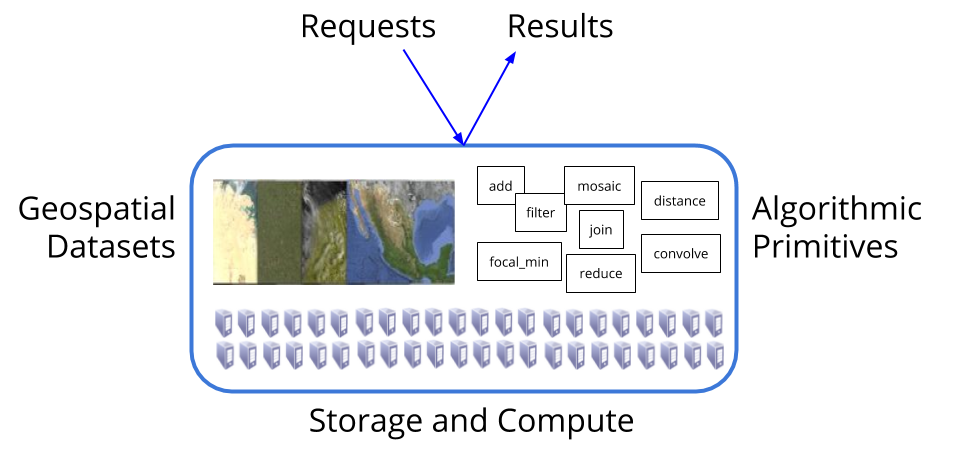
```  

## Earth Engine Fundamentals 

```{r, echo=FALSE, fig.align='center', out.width="1200px"}
   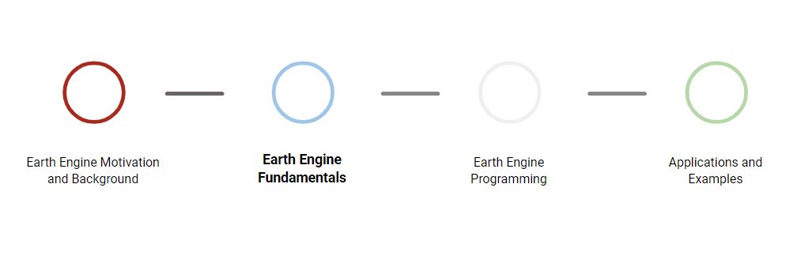
```

## Earth Engine Fundamentals 

"Earth Engine is not like any GIS you have ever used before! ... it is incredibly powerful. It is also strange and wondrous."  - [EE Developers Overview page](https://developers.google.com/earth-engine/concepts_overview)

- EE is a cloud-based platform for planetary-scale environmnetal data analysis, composed of:
   * Datasets, Google Computational Infrastructure, APIs, and a Code Editor (see [developers.google.com/earth-engine](developers.google.com/earth-engine))
- Images in Earth Engine stored at native resolution in native projection
- EE projects to Mercator when you dispaly images in code editor, and uses nearest neighbor sampling by default

## Earth Engine Fundamentals 
You'll need to sign up for an [Earth Engine account](http://signup.earthengine.google.com) to use the tools

- [The Explorer](http://explorer.earthengine.google.com): A Simple interface for visualization and basic analyses

- [EE Dataset Catalog](https://developers.google.com/earth-engine/datasets): A catalog of all available public datasets with great details on each dataset

- [The Code Editor](code.earthengine.google.com): The primary interface for EE - we'll go into details

## Earth Engine Fundamentals
- Much of these first several slides borrowed from [here](https://docs.google.com/presentation/d/10DTcBGPl0JeTEOJlSRNdj9dtGLwqq7HPLzegENygI-U/edit?usp=sharing)
- Almost all the breakout sessions at Geo4Good / EE Summit posted [here](https://sites.google.com/earthoutreach.org/geoforgood19/agenda/breakout-sessions) 

## Earth Engine Fundamentals

[The Code Editor](code.earthengine.google.com)

- A web-based environment for:

    * Running analyses
    
    * Investigating datasets
    
    * Managing scripts and data
    
    * Building interactive apps

## Earth Engine Fundamentals

```{r, echo=FALSE, fig.align='center', out.width="800px",fig.cap='Image source: https://developers.google.com/earth-engine/playground'}
   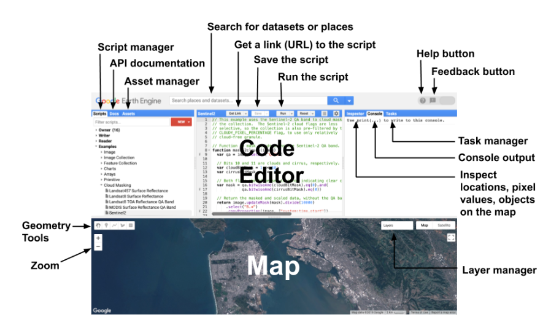
```

## Earth Engine Fundamentals
Earth Engine Objects:

- Images 
- Features
- Collections

## Earth Engine Fundamentals

<div class='left' style='float:left;width:48%'>

- Images have:

   * Bands: grid of pixels that have:
      + Name
      + CRS / Projection
      + Scale
   * Properties, at a minimum:
      + Date
      + Bounding box
      + Unique ID
 
   * [Code Editor Sample](https://code.earthengine.google.com/83880155a74987232b52a4ff587bf10b)     
</div>

<div class='right' style='float:right;width:48%'>


```{r, echo=FALSE, fig.align='center', out.width="600px",fig.cap='6-Band Image'}
   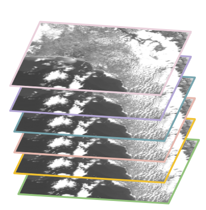
```
</div>


## Earth Engine Fundamentals

<div class='left' style='float:left;width:48%'>

- Features have:

   * Geometry (Point, Line, Polygon)
   * Properties (Same as images)
   * Features have geomtry property and a 'properties' property
      + 'properties' property just a dictionary for each feature
   * [Code Editor Sample](https://code.earthengine.google.com/d98c4f16ddcc390c788efa06dcad8983)   
</div>

<div class='right' style='float:right;width:48%'>


```{r, echo=FALSE, fig.align='center', out.width="700px",fig.cap='US Omernik Level 3 Ecoregions'}
   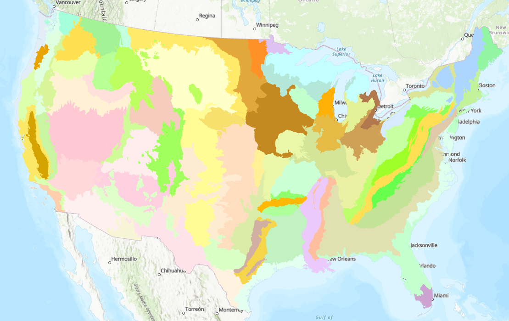
```
</div>

## Earth Engine Fundamentals

Collections

- Collections are typically what you encounter in the wild in EE
- They are unmodifiable, homogenous lists
- Both features and  images come as FeatureCollections or ImageCollections
- Take a minute to scroll through the [EE Data Catalog](https://developers.google.com/earth-engine/datasets)
   + You'll notice most datasets you check are image or feature collections

## Earth Engine Programming
```{r, echo=FALSE, fig.align='center', out.width="1200px"}
   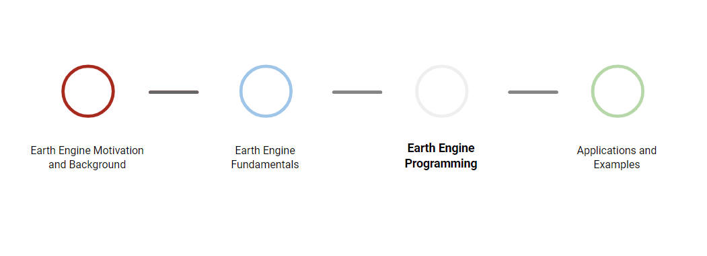
```

## Earth Engine Programming
What do we do with collections?

- Filtering
   + Select images / features meeting criteria
- Mapping
   + Apply a function to every image / feature in collection
- Reducing
   + Aggregate / Composite images and features 
      * i.e. mean / max of images, sum / mean of feature column
- Compositing and Mosaicking
   + Compositing: Combine spatially overlapping images into single band using an aggregate function (a reduction)
   + Mosaicking: Combining non-overlapping images into a spatially continuous image
- Control flows a no-no in EE
   + No for loops, conditionals - 

## Earth Engine Programming

Filtering

- [Filtering A FeatureCollection using metadata](https://code.earthengine.google.com/17a1342fdadf5c776508107f5b73dcb0) 

-[Filting An ImageCollection using space and time](https://code.earthengine.google.com/e0ee9b72f6656305784fb549629f5e9d)

## Earth Engine Programming

Mapping

- [Map a function over a FeatureCollection](https://code.earthengine.google.com/d952902a63ecd14cf78c77a92ea56df5) 

- [Map a function over an ImageCollection](https://code.earthengine.google.com/2e337839e43962c31fe50da0d8000d2f)

## Earth Engine Programming
Reducers

- [Example Image Reduction of monthly precip from PRISM](https://code.earthengine.google.com/d995de187124b81ed839fe326fb856f4)

- [Image statistics by regions (i.e. zonal statistics)](https://code.earthengine.google.com/782cd752d90155ca11b661f4b4cbbf77)

## Earth Engine Programming
Compositing and Mosaicking

-[Compositing](https://code.earthengine.google.com/f3ab6c759f996eed25f9b2e88ebcb7d5)

- [Mosaicking](https://code.earthengine.google.com/ddb18b15939898968e60e3fa4bcd6f62)


## Earth Engine Programming
Important take-homes for programming in EE:

- Earth Engine uses defered execution (lazy evaluation)
   + Results only derived when and where needed
      * i.e. in map window for display; as result of print statement
- Batch Processing
   + Operations in the code editor time out after 1 minute - that's all you get
   + Operations submitted in batch you get up to 1 week of processing time!
      * You set up a batch process by setting up an export task in your code
   + [Example Region Reduction and export of results](https://code.earthengine.google.com/782cd752d90155ca11b661f4b4cbbf77)
     
## Next Steps in EE Programming

Treasure trove of documentation and examples in the [Developer's Guide](https://developers.google.com/earth-engine/getstarted):

- Machine Learning Approaches
   * Developing TensorFlow models in EE
   * Supervised and Unsupervised classifications
- Image Processing
   * Spectral Transformations
   * Edge Detection
   * Morphological Operations (i.e. focal_min, focal_max)
- More on Reducers (weighted reductions, linear regression, etc)
- Joins
- Charting
- Array operations

## Python API
Why Python and not just stick to the Javascript Code Editor?

```{r, echo=FALSE, fig.align='center', out.height="500px", out.width="400px",fig.cap='Source: https://xkcd.com/353'}
   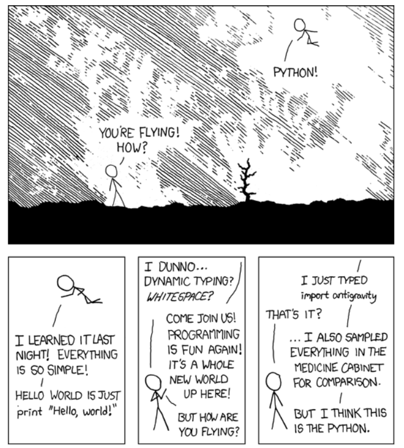
```

## Python API
```{r, echo=FALSE, fig.align='center', out.width="800px",fig.cap='Source: Tyler Erickson Geo4Good Earth Engine Python API slidedeck'}
   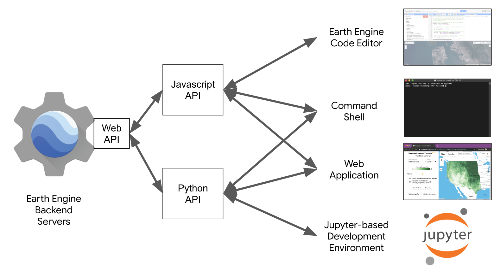
```

## Python API
```{r, echo=FALSE, fig.align='center', out.width="800px",fig.cap='Source: Tyler Erickson Geo4Good Earth Engine Python API slidedeck'}
   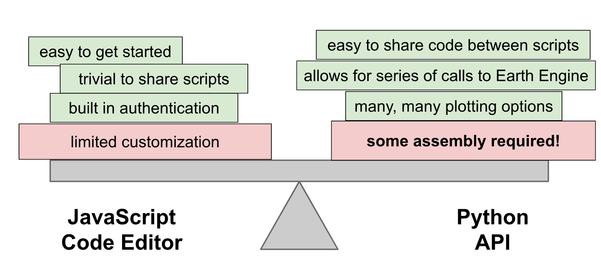
```

## Python API
Environments for running the EE Python API:

- [conda](https://conda.io/en/latest/)
   * This is how I've been using so far - good for running EE API conda on local computer, simple install
   
- [Google Colab](https://colab.research.google.com/notebooks/welcome.ipynb#recent=true)
   * hosted notebook environment (in the cloud), easy to install EE API and run Python code right away
   * For those used to Jupyter Notebooks, this is a hosted Jupyter Notebook that integrates Google Drive and GitHub
   
- [JupyterLab]

## Python API

- [Example of using Python API in Google Colab](https://colab.research.google.com/drive/1YC-oXAoaiZy6EjJ8gr3u6gRP8mzH4qqx)

## Python API
Should I use EE Code Editor or Python, and if Python what environment?

```{r, echo=FALSE, fig.align='center', out.width="800px",fig.cap='Source: Tyler Erickson Geo4Good Earth Engine Python API slidedeck'}
   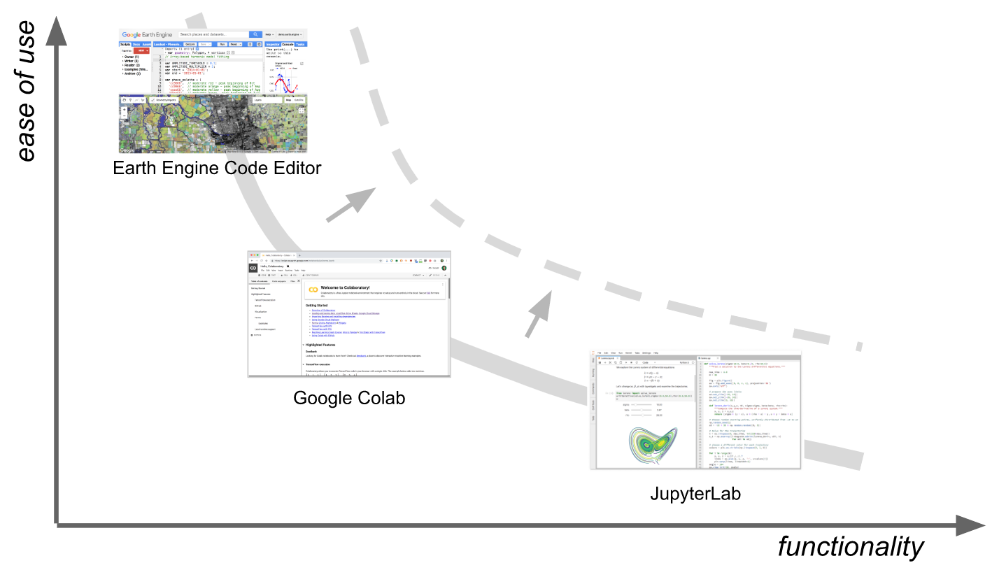
```

## Earth Engine Programming
```{r, echo=FALSE, fig.align='center', out.width="1200px"}
   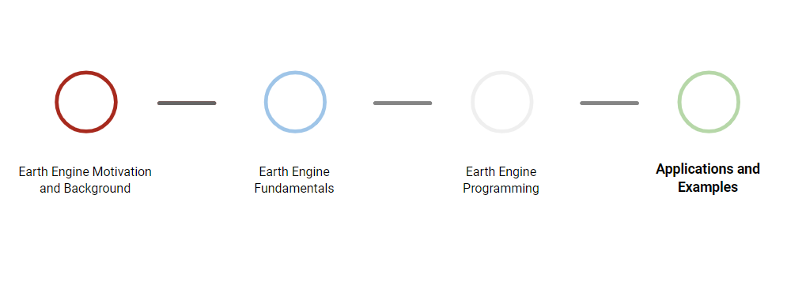
```

## Earth Engine Apps

- EE Apps are way to share an analysis or workflow and simple way to publish work
- [Example EE Apps](https://www.earthengine.app/)
- We *build* apps in the code editor and add *User Interface (UI)* widgets
   * Widgets:
      + Let users input parameters or interact with your script
      + Display information (labels, charts, thumbnails)
- Example 1: [Zoom Box of Night Light Trends](https://mweber36.users.earthengine.app/view/zoombox)
- Example 2: [NDVI Explorer](https://mweber36.users.earthengine.app/view/ndvi-explorer)

## New Developments

- [Big Query GIS](https://cloud.google.com/bigquery/docs/gis-intro)
   * Allows you to analyze massive vector GIS data and attribute data via SQL in Google Big Query
   
- [TensorFlow Object Model](https://developers.google.com/earth-engine/tensorflow)

- [Early Access Rest API](https://docs.google.com/presentation/d/1vQynmRLKwE8o2DTVa5CuiyCyDNZul_w0dQP9M1IF6Mw/edit#slide=id.g5d4a909b46_1_18)
   * EE computation and use the EE catalog from any language via an HTTP API - have to request to be whitelisted


## Personal and public assets
- [Requests](https://developers.google.com/earth-engine/help#dataset-requests)

## Resources

- [Earth Engine Developer pages](https://developers.google.com/earth-engine/) 
- [Geohackweek Earth Engine tutorial series](https://geohackweek.github.io/GoogleEarthEngine/)
- [GeoforGood 2019 Breakout Sessions](https://sites.google.com/earthoutreach.org/geoforgood19/agenda/breakout-sessions)
